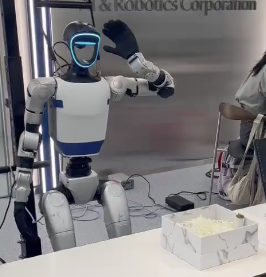

# G1 AI Omikuji Miko
<p align="center">
  <a href="assets/demo.mp4">
    
  </a>
</p>

<p align="center">
  <a href="assets/demo.mp4">▶ Watch the demo video</a>
</p>

<p align="center">
  <a href="https://savicktso.github.io/g1-ai-omikuji-miko/">
    
  </a>
</p>

## English

G1 AI Omikuji Miko is a hackathon demo that combines the Unitree G1 robot, LLM-generated responses, speech interaction, and omikuji-inspired fortune colors.

The goal is not to predict the future. It is to create a warm, shrine-like robot experience where a person speaks about a concern, draws a fortune, and receives a gentle response with matching robot motion.

Current fallback demo:

- listen to the user’s concern
- recognize user's selection of the fortune color: `gold`, `red`, or `blue`
- generated response text and motion label output

Run it with:

```bash

python3 -m speech.g1_voice_chat ETHERNET_DRIVE --asr-device cuda
```

## 日本語
<p align="center">
  <a href="assets/demo.mp4">
    
  </a>
</p>

<p align="center">
  <a href="assets/demo.mp4">▶ Watch the demo video</a>
</p>

<p align="center">
  <a href="https://savicktso.github.io/g1-ai-omikuji-miko/">
    
  </a>
</p>

G1 AI おみくじ巫女は、Unitree G1、LLM の応答生成、音声対話、おみくじの色分けを組み合わせたハッカソン用デモです。

未来を占うことが目的ではありません。人が悩みを話し、おみくじを引き、巫女のようなやさしい言葉と動きで返してもらう、神社のような雰囲気の体験をつくることが目的です。

現在のフォールバック版:

- ユーザーの悩みを聞く
- ユーザーが選択した签色（`gold`、`red`、`blue`）を認識する
- 応答テキストとモーションラベルを生成して出力する

実行方法:

```bash

python3 -m speech.g1_voice_chat ETHERNET_DRIVE --asr-device cuda
```

